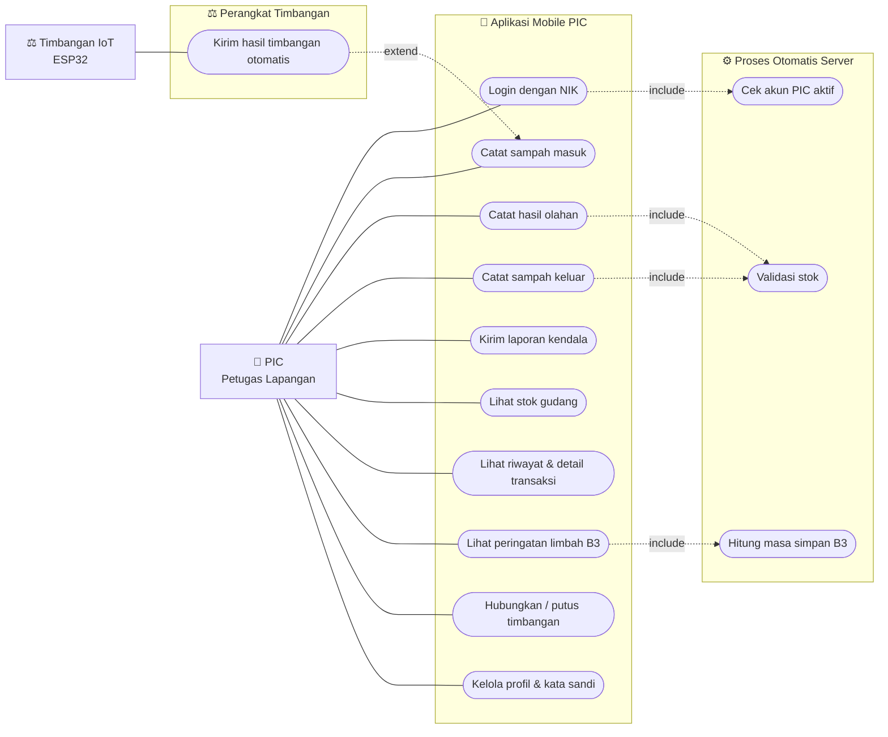
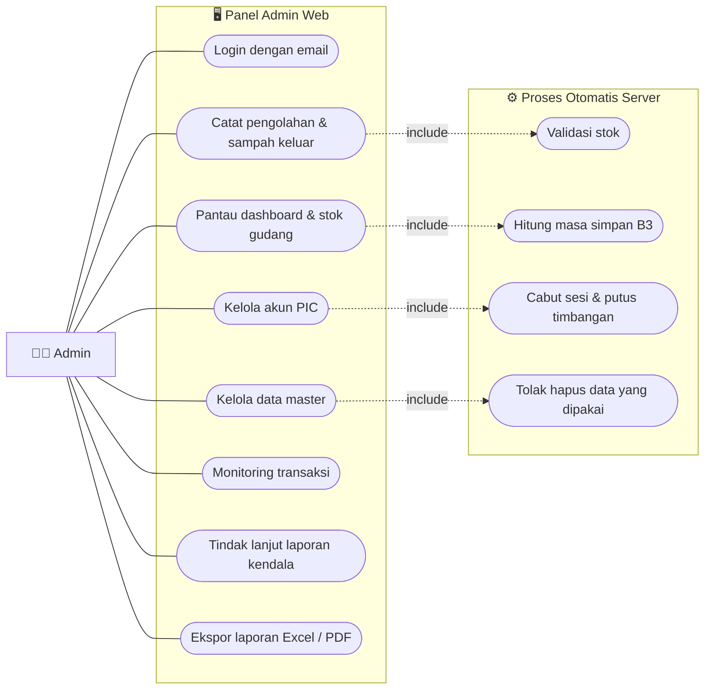
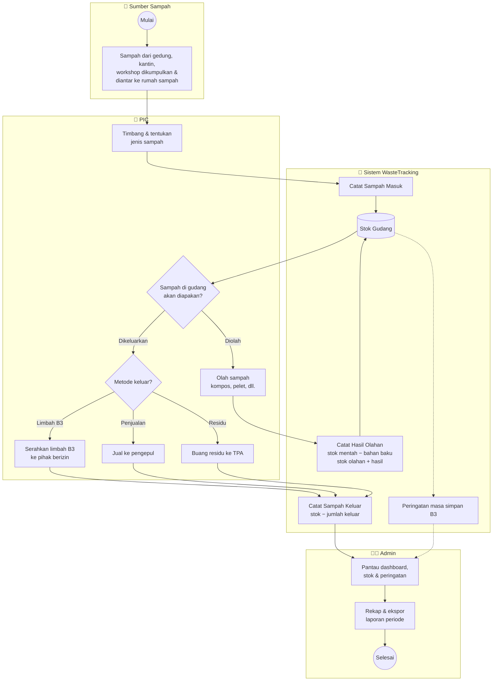
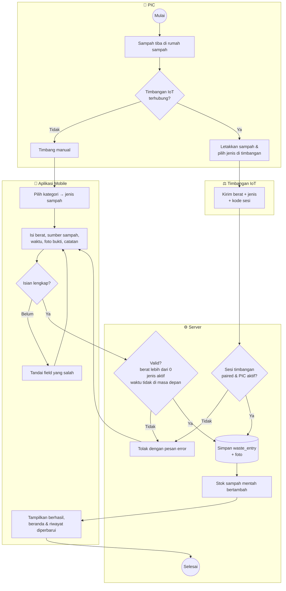
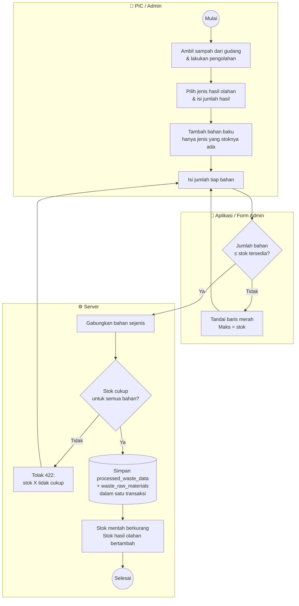
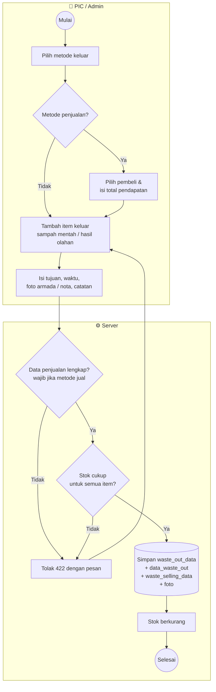
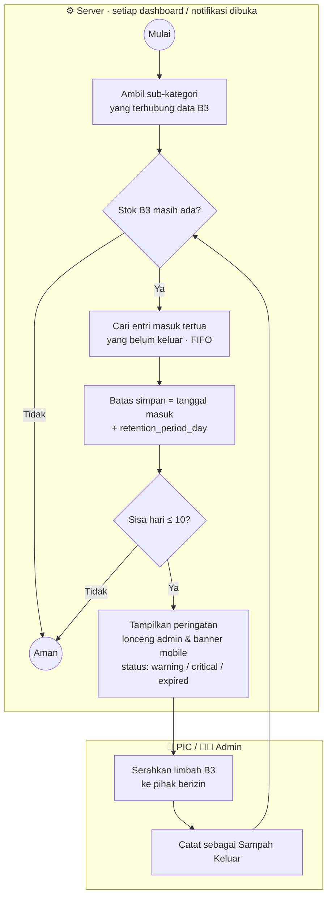
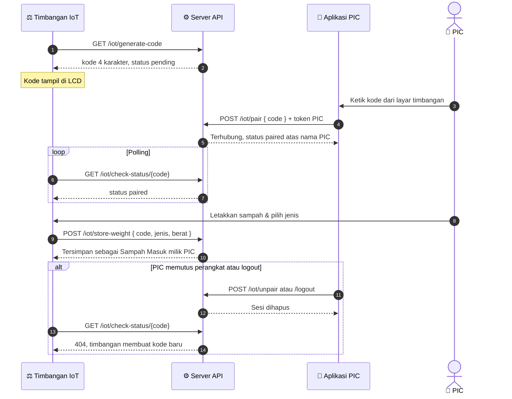
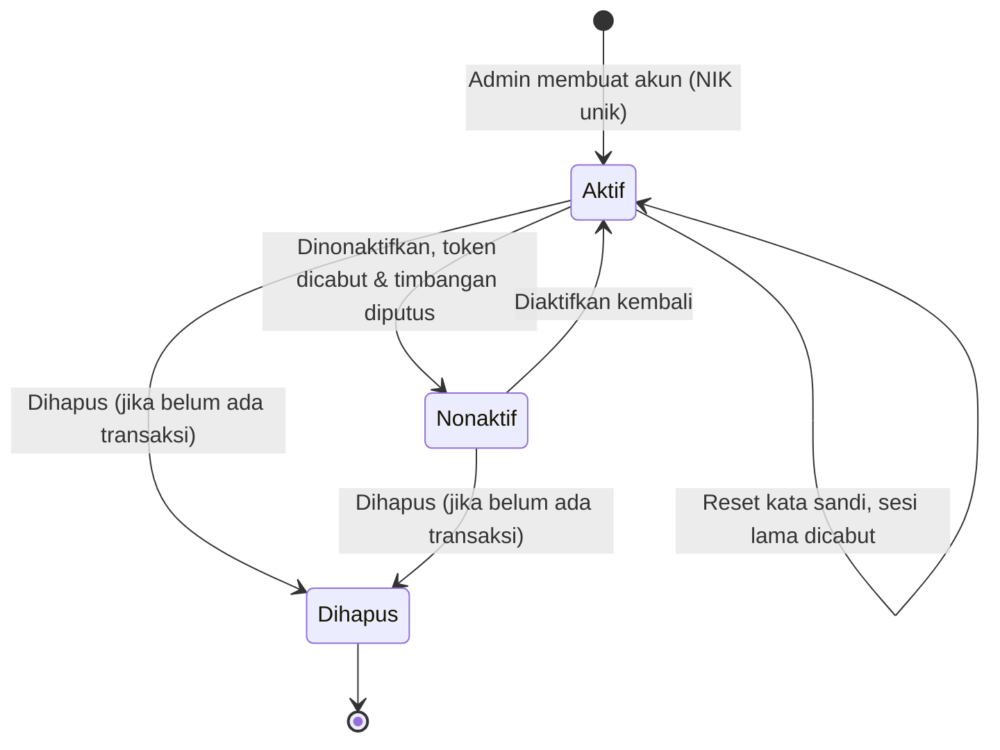

# WasteTracking — Web Admin & API

Sistem monitoring rumah sampah / TPST Politeknik Negeri Batam. Repository ini berisi:

- **Panel Admin (web)** untuk mengelola data master, memantau stok gudang, transaksi, dan laporan.
- **REST API** yang dipakai aplikasi mobile PIC (`mobile-digital-tracking-waste-system`) dan timbangan IoT ESP32 (`iot-digital-tracking-waste-system`).

| Komponen | Teknologi |
|---|---|
| Backend | Laravel 12, PHP 8.2+ (image Docker memakai PHP 8.3) |
| Autentikasi API | Laravel Sanctum (Bearer token) |
| Database | MySQL 8 (pengembangan & produksi), SQLite in-memory (test) |
| Tampilan admin | Blade + Tailwind CSS, Alpine.js, Lucide, Chart.js (dimuat dari CDN) |
| Ekspor | CSV (Excel) & halaman cetak PDF |

---

## Daftar Isi

1. [Gambaran Sistem](#1-gambaran-sistem)
2. [Use Case Diagram](#2-use-case-diagram)
3. [Model Proses Bisnis](#3-model-proses-bisnis)
4. [Instalasi dengan Docker (disarankan)](#4-instalasi-dengan-docker-disarankan)
5. [Instalasi tanpa Docker](#5-instalasi-tanpa-docker)
6. [Akun Bawaan (Data Dummy)](#6-akun-bawaan-data-dummy)
7. [Konfigurasi `.env`](#7-konfigurasi-env)
8. [Aturan Bisnis](#8-aturan-bisnis)
9. [Fitur Panel Admin](#9-fitur-panel-admin)
10. [Dokumentasi API](#10-dokumentasi-api)
11. [Alur Timbangan IoT](#11-alur-timbangan-iot)
12. [Struktur Database](#12-struktur-database)
13. [Struktur Folder](#13-struktur-folder)
14. [Testing](#14-testing)
15. [Deploy ke Produksi](#15-deploy-ke-produksi)
16. [Troubleshooting](#16-troubleshooting)

---

## 1. Gambaran Sistem

```
 Aplikasi Mobile PIC ──┐                    ┌──► Panel Admin (browser)
                       ├──► Laravel API ────┤
 Timbangan IoT ESP32 ──┘    (Sanctum)       └──► MySQL
```

**Peran pengguna**

| Peran | `role_id` | Akses |
|---|---|---|
| Admin | 1 | Login ke panel web dengan **email + kata sandi**. Tidak bisa memakai API mobile. |
| PIC (petugas lapangan) | 2 | Login ke aplikasi mobile dengan **NIK + kata sandi**. Tidak bisa login ke panel web. |

**Empat jenis transaksi**

| Transaksi | Tabel utama | Pengaruh ke stok |
|---|---|---|
| Sampah Masuk | `waste_entry` | Menambah stok sampah mentah |
| Pengolahan | `processed_waste_data` + `waste_raw_materials` | Mengurangi stok mentah (bahan baku), menambah stok hasil olahan |
| Sampah Keluar | `waste_out_data` + `data_waste_out` (+ `waste_selling_data` bila dijual) | Mengurangi stok mentah / hasil olahan |
| Laporan Kendala | `report` | — |

---

## 2. Use Case Diagram

Siapa melakukan apa di sistem. Garis putus-putus `include` berarti use case tersebut selalu menjalankan proses lain di server.

### 2.1 Aplikasi Mobile PIC & Timbangan IoT



### 2.2 Panel Admin Web



| Aktor | Peran |
|---|---|
| **PIC** | Petugas di rumah sampah/TPST. Mencatat semua aktivitas harian dari aplikasi mobile. |
| **Timbangan IoT** | Mengirim berat sampah otomatis atas nama PIC yang sedang terhubung. |
| **Admin** | Pengelola. Mengatur data master dan akun, memantau stok, dan membuat laporan. |

---

## 3. Model Proses Bisnis

### 3.1 Proses utama (end-to-end)

Perjalanan sampah dari sumber sampai keluar dari rumah sampah, beserta pencatatannya di sistem.



### 3.2 Proses sampah masuk

Bisa dicatat **manual dari aplikasi** atau **otomatis dari timbangan IoT**.



### 3.3 Proses pengolahan sampah



### 3.4 Proses sampah keluar



### 3.5 Pemantauan limbah B3



### 3.6 Pairing timbangan IoT



### 3.7 Siklus akun PIC



---

## 4. Instalasi dengan Docker (disarankan)

**Prasyarat:** Docker & Docker Compose v2.

```bash
git clone <url-repository> web-digital-tracking-waste-system
cd web-digital-tracking-waste-system
cp .env.example .env
```

Ubah bagian database di `.env` agar sesuai `docker-compose.yml`:

```dotenv
APP_URL=http://localhost:8000
APP_LOCALE=id

DB_CONNECTION=mysql
DB_HOST=mysql
DB_PORT=3306
DB_DATABASE=laravel
DB_USERNAME=root
DB_PASSWORD=root
```

Jalankan container lalu siapkan aplikasi:

```bash
docker compose up -d --build

docker compose exec app composer install
docker compose exec app php artisan key:generate
docker compose exec app php artisan migrate --seed      # --seed = isi data dummy
docker compose exec app php artisan storage:link        # agar foto upload bisa tampil
```

| Layanan | Alamat |
|---|---|
| Panel admin | http://localhost:8000 |
| API | http://localhost:8000/api |
| phpMyAdmin | http://localhost:8080 |
| MySQL dari host | `127.0.0.1:3306` (user `root` / `root`) |

Folder projek di-mount ke container (`.:/var/www`), jadi perubahan kode langsung terbaca tanpa rebuild. Setelah menarik perubahan baru, cukup jalankan:

```bash
docker compose exec app composer install
docker compose exec app php artisan migrate
docker compose exec app php artisan optimize:clear
```

> **Akses dari HP di jaringan yang sama:** gunakan IP komputer, misalnya `http://192.168.1.7:8000/api`, lalu jalankan aplikasi mobile dengan
> `flutter run --dart-define=API_HOST=http://192.168.1.7:8000`.

---

## 5. Instalasi tanpa Docker

**Prasyarat:** PHP 8.2+ (ekstensi `pdo_mysql`, `mbstring`, `zip`, `gd`, `exif`), Composer, MySQL 8.

```bash
composer install
cp .env.example .env
php artisan key:generate
```

Atur `.env` (`DB_HOST=127.0.0.1` dan kredensial MySQL lokal Anda), buat database kosong, lalu:

```bash
php artisan migrate --seed
php artisan storage:link
php artisan serve            # http://127.0.0.1:8000
```

> Node.js/npm **tidak wajib**. Tampilan admin memuat Tailwind, Alpine, Lucide, dan Chart.js dari CDN, sehingga browser perlu koneksi internet.

---

## 6. Akun Bawaan (Data Dummy)

Dibuat oleh `php artisan migrate --seed` (`database/seeders/DummyDataSeeder.php`):

| Peran | Login | Kata sandi |
|---|---|---|
| Admin | `admin@gmail.com` | `admin` |
| PIC 1 | NIK `12345678901` | `password` |
| PIC 2 | NIK `12345678902` | `password` |

Seeder juga mengisi kategori, sub-kategori, satuan, lokasi, metode keluar ("Penjualan" bertanda metode jual), pembeli, dan contoh transaksi.

> ⚠️ **Jangan jalankan seeder di produksi** dan segera ganti kata sandi akun bawaan. Sebagian data dummy lama bisa menghasilkan stok minus (dibuat sebelum validasi stok ada). Hal ini wajar untuk data contoh.

---

## 7. Konfigurasi `.env`

| Variabel | Keterangan |
|---|---|
| `APP_URL` | URL publik aplikasi. Dipakai untuk membentuk URL foto (`/storage/...`). Harus benar agar foto tampil di mobile. |
| `APP_DEBUG` | `true` saat pengembangan, **wajib `false` di produksi**. |
| `DB_*` | Koneksi MySQL. |
| `SESSION_DRIVER`, `CACHE_STORE`, `QUEUE_CONNECTION` | Default `database` (tabel sudah dibuat oleh migrasi). |

Zona waktu aplikasi dikunci ke **Asia/Jakarta (WIB)** dan locale tanggal ke **Bahasa Indonesia** di `app/Providers/AppServiceProvider.php`.

---

## 8. Aturan Bisnis

Semua aturan ini berlaku sama di API mobile maupun panel admin.

### Stok gudang
Stok **tidak disimpan di tabel**, melainkan dihitung dari transaksi oleh `app/Services/StockService.php`:

```
Stok sampah mentah  = Σ sampah masuk − Σ sampah keluar (mentah) − Σ dipakai pengolahan
Stok hasil olahan   = Σ hasil pengolahan − Σ sampah keluar (olahan)
```

### Validasi transaksi
- **Stok tidak boleh minus.** Sampah keluar atau bahan baku pengolahan yang melebihi stok **ditolak** (HTTP 422) dengan pesan seperti
  *"Stok Botol Plastik tidak cukup (tersedia 2 kg, diminta 3 kg)."* Item yang sama dalam satu transaksi dijumlahkan dahulu.
- **Berat/jumlah harus > 0.**
- **Waktu transaksi** boleh diisi mundur (input susulan), tetapi **tidak boleh di masa depan** (toleransi 5 menit untuk selisih jam HP). Jika kosong, dipakai waktu server.
- **Desimal dengan koma** (`1,5`) diterima dan dibaca sama seperti `1.5`.
- **Sub-kategori nonaktif** tidak bisa dipakai untuk sampah masuk baru dan tidak tampil di aplikasi.
- **Metode penjualan** (`waste_out_method.is_selling = true`) wajib mengisi pembeli dan total pendapatan.

### Limbah B3
Sub-kategori yang terhubung ke `waste_b3_detail` dianggap limbah B3. Peringatan muncul jika umur stok B3 **≤ 10 hari** dari batas `retention_period_day`. Umur dihitung secara **FIFO**: stok tertua dianggap keluar/diolah lebih dulu. B3 yang stoknya sudah habis tidak diberi peringatan.

### Akun & keamanan
- PIC hanya bisa melihat data miliknya sendiri (riwayat dan detail transaksi).
- Akun yang **dinonaktifkan** admin langsung tidak bisa memakai API (token dicabut, timbangan IoT diputus).
- Reset kata sandi oleh admin dan ganti kata sandi oleh PIC akan mengeluarkan sesi di perangkat lain.
- Logout dari aplikasi mobile ikut memutus timbangan IoT yang terhubung ke akun tersebut.

### Penghapusan data master
Data master yang **sudah dipakai transaksi tidak bisa dihapus** (sub-kategori, lokasi, satuan, jenis olahan, pembeli, metode, data B3, akun PIC). Untuk sub-kategori dan akun PIC, ubah status menjadi **Nonaktif**.

---

## 9. Fitur Panel Admin

| Menu | Fungsi |
|---|---|
| Dashboard | Ringkasan hari ini (kg masuk/keluar/diolah), pendapatan, grafik 14 hari, stok terbanyak, peringatan B3 & stok minus |
| Stok Gudang | Stok per jenis sampah & hasil olahan, filter kategori/status, tabel masa simpan B3 |
| Sampah Masuk | Daftar & detail transaksi masuk, filter kategori/tanggal/pencarian |
| Pengolahan | Daftar, detail (bahan baku), dan form catat pengolahan dengan info stok |
| Sampah Keluar | Daftar, detail, dan form catat sampah keluar (mentah/olahan) dengan info stok |
| Laporan Data Sampah | Rekap per periode, grafik, ekspor CSV (Excel) & cetak PDF |
| Laporan Kendala PIC | Laporan masalah lapangan dari aplikasi mobile |
| Data Master | Kategori, sub-kategori, limbah B3, jenis olahan, satuan, sumber sampah, metode keluar, pengepul/pembeli, kategori kendala |
| Kelola PIC | Tambah/edit akun PIC, reset kata sandi, aktif/nonaktifkan |

Lonceng di navbar menampilkan limbah B3 yang perlu ditindaklanjuti (di-cache 60 detik).

---

## 10. Dokumentasi API

- **Base URL:** `{APP_URL}/api`
- **Header wajib:** `Accept: application/json`
- **Endpoint terkunci:** `Authorization: Bearer <token>` dari `/login`. Hanya untuk akun PIC aktif.
- Form dengan foto dikirim sebagai `multipart/form-data`. Daftar item (`items`, `raw_materials`) boleh berupa **string JSON** maupun array.

### Format respons

```jsonc
// Sukses
{ "success": true, "message": "…", "data": { … } }

// Validasi gagal — HTTP 422
{ "message": "Stok Botol Plastik tidak cukup …", "errors": { "items": ["Stok Botol Plastik tidak cukup …"] } }

// Token tidak valid / akun nonaktif — HTTP 401
{ "success": false, "message": "Sesi berakhir atau akun Anda dinonaktifkan. Silakan login kembali." }
```

| Kode | Arti |
|---|---|
| 200 / 201 | Berhasil |
| 401 | Belum login, token dicabut, atau akun nonaktif → aplikasi harus kembali ke halaman login |
| 403 | Tidak berhak (mis. akun bukan PIC, perangkat milik akun lain) |
| 404 | Data tidak ditemukan **atau milik PIC lain** |
| 409 | Data masih dipakai data lain |
| 422 | Validasi gagal (lihat `errors`) |
| 429 | Terlalu banyak request (login & endpoint IoT dibatasi) |

### Endpoint publik

| Method | Endpoint | Keterangan |
|---|---|---|
| POST | `/login` | Body: `nik`, `password`. Respons: `token`, `user`. Dibatasi 10×/menit. |
| GET | `/iot/generate-code` | Perangkat IoT meminta kode pairing baru |
| GET | `/iot/check-status/{code}` | Perangkat IoT mengecek apakah kode sudah dipasangkan |
| POST | `/iot/store-weight` | Body: `code`, `id_waste_sub_category`, `measured_qty` |
| GET | `/waste-subcategories` | Daftar sub-kategori aktif (untuk layar timbangan) |

Endpoint IoT dibatasi 120 request/menit per IP.

### Endpoint terkunci (Bearer token PIC)

**Akun**

| Method | Endpoint | Body / Query |
|---|---|---|
| GET | `/user` | — (data PIC yang login) |
| POST | `/logout` | — |
| POST | `/update-profile` | `name`, `email`, `phone?`, `photo?` (file) |
| POST | `/change-password` | `old_password`, `new_password` (min. 8, harus berbeda) |

**Data master & stok**

| Method | Endpoint | Keterangan |
|---|---|---|
| GET | `/categories` | Kategori + jumlah sub-kategori aktif |
| GET | `/sub-categories/{category_id}` | Sub-kategori aktif + `unit`, `stock`, `b3_detail` |
| GET | `/source-locations` | Sumber sampah |
| GET | `/processed-waste` | Jenis olahan + `unit`, `stock` |
| GET | `/waste-out-methods` | Metode keluar + `is_selling` |
| GET | `/waste-buyers` | Pengepul/pembeli |
| GET | `/waste-destinations` | Tujuan sampah |
| GET | `/kategori-kendala` | Kategori laporan kendala |
| GET | `/waste-stocks` | Stok gudang. `id` angka = sampah mentah, `p_{id}` = hasil olahan |
| GET | `/waste-b3-notifications` | Peringatan masa simpan limbah B3 |
| GET | `/dashboard-data` | Ringkasan hari ini (jumlah transaksi & berat), entri terbaru, jumlah peringatan B3 |

**Transaksi**

| Method | Endpoint | Body |
|---|---|---|
| POST | `/waste-entry` | `id_waste_sub_category`, `id_source_location_waste`, `measured_qty`, `created_at?`, `notes?`, `photo?` |
| POST | `/processed-waste-data` | `id_processed_waste`, `measured_qty`, `raw_materials`, `created_at?`, `notes?` |
| POST | `/waste-out` | `id_waste_out_method`, `items`, `id_waste_destination?`, `id_buyer?`, `total_revenue?`, `created_at?`, `notes?`, `photo?` |
| POST | `/laporan-kendala` | `id_category_report`, `title`, `content`, `attachment?` |

Format `created_at`: `Y-m-d H:i:s` (contoh `2026-10-08 14:30:00`).

```jsonc
// raw_materials (pengolahan)
[{ "id_waste_sub_category": 1, "measured_qty": 5 }]

// items (sampah keluar) — "p_" di depan id = hasil olahan
[{ "id_sub_category": 3, "quantity": 2.5 }, { "id_sub_category": "p_1", "quantity": 1 }]
```

**Riwayat & detail** (hanya data milik PIC yang login)

| Method | Endpoint | Keterangan |
|---|---|---|
| GET | `/riwayat-laporan` | Query: `search?`, `type?` (1 Masuk, 2 Keluar, 3 Olahan, 4 Kendala), `date_from?`, `date_to?`. Data dikelompokkan per tanggal. |
| GET | `/laporan-harian` | Daftar sampah masuk |
| GET | `/laporan-harian/{id}` | Detail sampah masuk |
| GET | `/processed-waste-data/{id}` | Detail pengolahan + bahan baku |
| GET | `/waste-out/{id}` | Detail sampah keluar + item + penjualan |
| GET | `/laporan-kendala/{id}` | Detail laporan kendala |

**IoT (dari aplikasi)**

| Method | Endpoint | Body |
|---|---|---|
| GET | `/iot/session` | Status timbangan yang terhubung ke akun |
| POST | `/iot/pair` | `code` (perangkat selalu dipasangkan ke akun yang login) |
| POST | `/iot/unpair` | `code` |

### Contoh dengan cURL

```bash
# Login
curl -X POST http://localhost:8000/api/login \
  -H "Accept: application/json" -d "nik=12345678901&password=password"

# Catat sampah masuk
curl -X POST http://localhost:8000/api/waste-entry \
  -H "Accept: application/json" -H "Authorization: Bearer <TOKEN>" \
  -F id_waste_sub_category=1 -F id_source_location_waste=1 -F measured_qty=12,5 \
  -F photo=@foto.jpg

# Catat sampah keluar
curl -X POST http://localhost:8000/api/waste-out \
  -H "Accept: application/json" -H "Authorization: Bearer <TOKEN>" \
  -F id_waste_out_method=2 -F 'items=[{"id_sub_category":1,"quantity":1.5}]'
```

---

## 11. Alur Timbangan IoT

```
1. Timbangan  → GET  /iot/generate-code         → tampilkan kode 4 karakter di LCD
2. PIC (app)  → POST /iot/pair  { code }         → sesi berstatus "paired" atas nama PIC
3. Timbangan  → GET  /iot/check-status/{code}    → mulai mode menimbang
4. Timbangan  → POST /iot/store-weight           → tercatat sebagai Sampah Masuk milik PIC
5. PIC (app)  → POST /iot/unpair  atau logout    → sesi dihapus, timbangan membuat kode baru
```

Sistem mengasumsikan **satu perangkat timbangan**: setiap `generate-code` menghapus sesi aktif sebelumnya.

---

## 12. Struktur Database

Relasi antar tabel (tabel bawaan framework seperti `sessions`, `cache`, `jobs`, dan `personal_access_tokens` tidak digambarkan):

```mermaid
erDiagram
    role {
        bigint id PK
        string name "admin atau pic"
    }
    users {
        bigint id PK
        string email
        string password
        bigint role_id FK
        boolean is_active
        string photo "nullable"
        timestamp created_at
        timestamp updated_at
    }
    admin_detail {
        bigint id_user PK, FK
        string full_name
    }
    pic_detail {
        bigint id_user PK, FK
        string full_name
        string nik "dipakai login mobile"
        string phone "nullable"
    }
    iot_auth_sessions {
        bigint id PK
        string code UK "kode 4 karakter"
        bigint id_user FK "nullable"
        enum status "pending, paired, completed"
        timestamp created_at
        timestamp updated_at
    }
    unit_measured {
        bigint id PK
        string name
        string type "weight, volume, count"
        string symbol "nullable"
    }
    waste_category {
        bigint id PK
        string name
        text description
        string photo "nullable"
    }
    waste_b3_detail {
        bigint id PK
        string waste_code
        string description
        int retention_period_day
        int danger_level "1 sampai 5"
    }
    waste_sub_category {
        bigint id PK
        bigint id_waste_category FK
        bigint id_waste_b3_detail FK "nullable, terisi jika B3"
        bigint id_unit_measured FK
        string name
        text description "nullable"
        string photo "nullable"
        boolean is_active
        decimal default_measured_qty
    }
    processed_waste {
        bigint id PK
        bigint id_unit_measured FK
        string name
        text description "nullable"
        string photo "nullable"
        decimal default_measured_qty
    }
    source_location_waste {
        bigint id PK
        string name
        text address "nullable"
        string photo "nullable"
    }
    waste_out_method {
        bigint id PK
        string name
        text description "nullable"
        boolean is_selling "wajib pembeli jika true"
        string photo "nullable"
    }
    waste_destinations {
        bigint id PK
        string name
        string location
        string photo "nullable"
    }
    data_collector_buyer {
        bigint id PK
        string name
        string phone_number
        string address
        string email
        string website "nullable"
        text notes "nullable"
    }
    category_report {
        bigint id PK
        string name
    }
    waste_entry {
        bigint id PK
        bigint id_user FK
        bigint id_waste_sub_category FK
        bigint id_source_location_waste FK "nullable, kosong jika dari IoT"
        decimal measured_qty
        text notes "nullable"
        timestamp created_at "waktu transaksi"
    }
    attachment_waste_entry {
        bigint id_waste_entry PK, FK
        string path
    }
    processed_waste_data {
        bigint id PK
        bigint id_processed_waste FK
        bigint id_user FK
        decimal measured_qty "jumlah hasil olahan"
        text notes "nullable"
        timestamp created_at
    }
    waste_raw_materials {
        bigint id PK
        bigint id_processed_waste_data FK
        bigint id_waste_sub_category FK
        decimal measured_qty "bahan baku terpakai"
    }
    attachment_processed_waste_data {
        bigint id PK, FK "id processed_waste_data"
        string path
    }
    waste_out_data {
        bigint id PK
        bigint id_user FK
        bigint id_waste_out_method FK
        bigint id_waste_destination FK "nullable"
        text notes "nullable"
        timestamp created_at
    }
    data_waste_out {
        bigint id PK
        bigint id_waste_out_data FK
        boolean is_processed_waste
        bigint id_waste_sub_category FK "nullable, item mentah"
        bigint id_processed_waste FK "nullable, item olahan"
        decimal measured_qty
    }
    waste_selling_data {
        bigint id PK
        bigint id_waste_out_data FK
        bigint id_buyer FK
        decimal total_revenue
        timestamp created_at
    }
    attachment_waste_out_data {
        bigint id_waste_out_data PK, FK
        string path
    }
    report {
        bigint id PK
        bigint id_user FK
        bigint id_category_report FK
        string title "nullable"
        longtext content "nullable"
        timestamp created_at
    }
    attachment_report {
        bigint id_report PK, FK
        string path
    }

    role ||--o{ users : "memiliki"
    users ||--o| admin_detail : "profil admin"
    users ||--o| pic_detail : "profil PIC"
    users |o--o{ iot_auth_sessions : "memasangkan timbangan"
    waste_category ||--o{ waste_sub_category : "terdiri dari"
    waste_b3_detail |o--o{ waste_sub_category : "klasifikasi B3"
    unit_measured ||--o{ waste_sub_category : "satuan"
    unit_measured ||--o{ processed_waste : "satuan"
    users ||--o{ waste_entry : "mencatat"
    waste_sub_category ||--o{ waste_entry : "jenis sampah"
    source_location_waste |o--o{ waste_entry : "asal sampah"
    waste_entry ||--o| attachment_waste_entry : "foto bukti"
    users ||--o{ processed_waste_data : "mencatat"
    processed_waste ||--o{ processed_waste_data : "jenis hasil"
    processed_waste_data ||--|{ waste_raw_materials : "memakai bahan"
    waste_sub_category ||--o{ waste_raw_materials : "bahan baku"
    processed_waste_data ||--o| attachment_processed_waste_data : "foto bukti"
    users ||--o{ waste_out_data : "mencatat"
    waste_out_method ||--o{ waste_out_data : "metode"
    waste_destinations |o--o{ waste_out_data : "tujuan"
    waste_out_data ||--|{ data_waste_out : "berisi item"
    waste_sub_category |o--o{ data_waste_out : "item mentah"
    processed_waste |o--o{ data_waste_out : "item olahan"
    waste_out_data ||--o| waste_selling_data : "data penjualan"
    data_collector_buyer ||--o{ waste_selling_data : "pembeli"
    waste_out_data ||--o| attachment_waste_out_data : "foto bukti"
    users ||--o{ report : "melapor"
    category_report ||--o{ report : "kategori"
    report ||--o| attachment_report : "foto pendukung"
```



Ringkasan tabel:

| Kelompok | Tabel |
|---|---|
| Akun | `role`, `users`, `admin_detail`, `pic_detail`, `iot_auth_sessions`, `personal_access_tokens` |
| Data master | `waste_category`, `waste_sub_category`, `waste_b3_detail`, `unit_measured`, `processed_waste`, `source_location_waste`, `waste_out_method`, `waste_destinations`, `data_collector_buyer`, `category_report` |
| Transaksi | `waste_entry`, `processed_waste_data`, `waste_raw_materials`, `waste_out_data`, `data_waste_out`, `waste_selling_data`, `report` |
| Lampiran foto | `attachment_waste_entry`, `attachment_processed_waste_data`, `attachment_waste_out_data`, `attachment_report` |

File yang diunggah tersimpan di `storage/app/public/` dan diakses lewat `{APP_URL}/storage/...` (memerlukan `php artisan storage:link`).

---

## 13. Struktur Folder

```
app/
├── Http/
│   ├── Controllers/
│   │   ├── Admin/            # Controller panel web
│   │   └── Api/              # Controller API mobile & IoT
│   │       └── Concerns/     # Validasi waktu transaksi & input JSON bersama
│   └── Middleware/
│       └── EnsureActivePic.php   # Tolak token akun nonaktif / bukan PIC
├── Models/
├── Providers/AppServiceProvider.php  # Locale, timezone, data peringatan B3 di layout
└── Services/StockService.php         # Perhitungan & validasi stok, peringatan B3
bootstrap/app.php            # Registrasi middleware & penanganan error foreign key
database/
├── migrations/
└── seeders/DummyDataSeeder.php
resources/views/
├── components/              # page-header, modal, stat-card, empty-state
├── layouts/                 # Layout admin, sidebar, navbar
└── pages/                   # Halaman per menu
routes/
├── web.php                  # Panel admin (/admin/...)
└── api.php                  # API (/api/...)
tests/Feature/               # Test API, aturan bisnis, & render halaman admin
docker/                      # Dockerfile (dev & prod) dan konfigurasi nginx
```

---

## 14. Testing

Test memakai SQLite in-memory, sehingga tidak menyentuh database pengembangan.

```bash
# Dengan Docker
docker compose exec app php artisan test

# Tanpa Docker
php artisan test

# Satu file / satu test
php artisan test tests/Feature/Api/BusinessRulesTest.php
php artisan test --filter=test_stok_out_exceeding_stock_is_rejected
```

Cakupan utama:
- `tests/Feature/Api/BusinessRulesTest.php`: validasi stok, kepemilikan data, akun nonaktif, penjualan, logout & IoT.
- `tests/Feature/Admin/AdminPagesTest.php`: semua halaman admin berhasil dirender, larangan hapus data terpakai.
- `tests/Feature/{SampahMasuk,SampahKeluar,Pengolahan,Stok,B3,Catatan,...}`: skenario per fitur.

---

## 15. Deploy ke Produksi

Produksi memakai `docker-compose.prod.yml` (PHP-FPM Alpine + nginx di port **8080** + MySQL). Taruh di belakang reverse proxy HTTPS (Nginx/Caddy/Cloudflare). Aplikasi sudah mempercayai header proxy (`trustProxies`).

**Pertama kali**

```bash
cp .env.example .env    # isi: APP_ENV=production, APP_DEBUG=false, APP_URL=https://domain-anda, DB_*
docker compose -f docker-compose.prod.yml up -d --build
docker compose -f docker-compose.prod.yml exec app php artisan key:generate
docker compose -f docker-compose.prod.yml exec app php artisan migrate --force
docker compose -f docker-compose.prod.yml exec app php artisan storage:link
```

Buat akun admin pertama lewat `php artisan tinker` (jangan memakai seeder dummy).

**Setiap update**

```bash
git pull
docker compose -f docker-compose.prod.yml up -d --build
docker compose -f docker-compose.prod.yml exec app php artisan migrate --force
docker compose -f docker-compose.prod.yml exec app php artisan optimize:clear
```

> **Penting:** server dan aplikasi mobile sebaiknya dirilis **bersamaan**. Endpoint data master kini wajib login, sehingga aplikasi mobile versi lama tidak berfungsi penuh dengan server versi ini.

### Catatan produksi yang perlu diperhatikan

- **Batas ukuran upload.** Bawaan PHP adalah `upload_max_filesize=2M` dan bawaan nginx `client_max_body_size 1m`, sedangkan validasi foto mengizinkan hingga 5 MB. Naikkan keduanya (misalnya 10M) agar foto dari HP tidak ditolak dengan error 413.
- **Belum ada `.dockerignore`.** Akibatnya `.env` dan folder lain ikut tersalin ke image produksi. Tambahkan `.dockerignore` (minimal `.env`, `.git`, `vendor`, `node_modules`, `tests`).
- **Volume `public_prod` & `cache_prod`.** Keduanya hanya terisi saat pertama kali dibuat. File baru di `public/` tidak otomatis ikut setelah rebuild, dan cache lama di `bootstrap/cache` harus dibersihkan (`optimize:clear`) setiap deploy.
- **Backup database.** Data hanya ada di volume `mysql_data_prod`. Jadwalkan `mysqldump` berkala ke lokasi lain.

---

## 16. Troubleshooting

| Masalah | Penyebab & solusi |
|---|---|
| Foto tidak tampil (404 di `/storage/...`) | Jalankan `php artisan storage:link` dan pastikan `APP_URL` benar. |
| `SQLSTATE[HY000] [2002] getaddrinfo for mysql failed` | Menjalankan artisan di luar Docker padahal `DB_HOST=mysql`. Jalankan lewat `docker compose exec app …` atau ubah `DB_HOST=127.0.0.1`. |
| Route baru 404 setelah update | Cache route/config lama. Jalankan `php artisan optimize:clear`. |
| Upload foto gagal (413 / foto hilang) | Lihat *Batas ukuran upload* di bagian 15. |
| Aplikasi mobile selalu kembali ke login | Token ditolak (401): akun dinonaktifkan, kata sandi direset admin, atau token lama. Login ulang. |
| Transaksi keluar/olahan ditolak "stok tidak cukup" | Sesuai aturan bisnis. Pastikan sampah masuk sudah dicatat; cek menu **Stok Gudang**. |
| Ada stok minus di Stok Gudang | Berasal dari data lama sebelum validasi stok diterapkan. Periksa transaksinya. |
| Data master tidak bisa dihapus | Masih dipakai transaksi. Nonaktifkan (sub-kategori/PIC) alih-alih menghapus. |
| Login admin ditolak "tidak memiliki akses admin" | Akun tersebut PIC (`role_id = 2`). PIC hanya bisa login di aplikasi mobile. |
| Tampilan admin berantakan | Aset Tailwind/Alpine dimuat dari CDN. Pastikan browser terhubung ke internet. |
